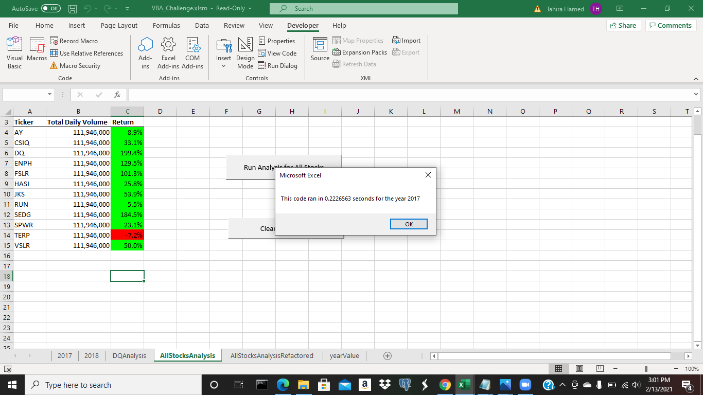

# stock-analysis
Mod 2: Excel: Stock-Analysis 
## VBA_Challenge

OVERVIEW 

The Purpose of this Analysis 
	
The purpose of this analysis is to improve the information provided to Steve about the stock market by including the entire stock market's data over the past few years. By doing this, a  

RESULTS  

Performance Between 2017 and 2018
	
The stock performance between 2017 and 2018 shows that year 2017 stock data runs slower than 2018 once refactored. As shown below, year 2017 stock runs at 0.2226563 seconds. 

Open the file containing VBA Challenge 2017.
VBA Challenge 2017.

Close the file.

In contrast, year 2018 data of performance in seconds decreased. As shown in the image, the stock analysis for 2018 runs at 0.2148438 seconds. 

Open the file containing the VBA_Challenge_2018.
VBA_Challenge_2018.

Close the file. 
 
 Execution Times of the Original Script and the Refactored Script 

The execution times of the original script and the refactored script improved while running the refactored code. For instance, the original script runs slower than the refactored year. For instance, the Original Script of year 2017 stock data runs at 1.164063 and the Refactored Script for year 2017 stock data runs at 0.2226563 seconds.

Additionally, the Original Script of year 2018 stock dara runs at 1.164063 seconds, and the Refactored Script for 2018 stock data runs of 0.2148438 seconds.

SUMMARY  

Advantages of Refactoring Code 
	
The advantages of refactoring code are that the data is already presented for the analyst to present to Steve. Refactored data allows the analyst to loop through all of the data presented at a faster pace. The stock market data is provided to Steve under one minute.  

Disadvantages of Refactoring Code 

Disadvantages of refactoring code is editing the original code. If the edited code is improperly written to loop through the data to present at a faster pace. The data could run slowly or not running at all due to errors. In addition, once the code is running at a faster pace, the times may differ each time.    

Pros Applying to Refactoring the Original VBA Script 

Pros applying to refactoring is the process of editing the original VBA code. This provides Steve and the analyst to have access to what has already been worked on in the original script. On the contrary, providing notes in the script allows future coders to understand where the edits were entered and how to edit the original script to properly loop through all of the data. 

Cons Applying to Refactoring the Original VBA Script 

Cons applying to refactoring the original script is understanding that refactoring is not the process of adding new functionality. Refactoring is editing is the process of editing the original code to improve VBA script to run results quickly. If the edited code is properly entered into VBA code, then you may proceed with the refactoring process. In contrast, if refactored information is not correctly entered, then VBA script will not properly run until the correct information is provided in the script to run through the data. 
