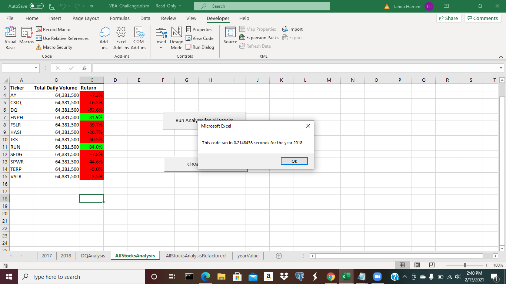

# stock-analysis
Mod 2: Excel: Stock-Analysis 
## VBA_Challenge

OVERVIEW 

The Purpose of this Analysis 
	
The purpose of this analysis is to improve the information provided to Steve about the stock market by including the entire stock market's data over the past few years. By doing this, a  

RESULTS  

Performance Between 2017 and 2018
	
The stock performance between 2017 and 2018 show that 2017 stock data runs slower than the stock data of 2018. As shown below, year 2017 stock runs at 0.2226563, and year 2018 stock runs at 0.2148438). 

Open the file containing the Linux mascot.
Marvel at its beauty.

Tux, the Linux mascot

Close the file.

Open the file containing the VBA_Challenge_2017.
VBA_Challenge_2017.

Close the file.

This data was an improvement compared to the 2018 performance. Showing that the stock performance decreased due to... 

Open the file containing the VBA_Challenge_2018.
VBA_Challenge_2018.

CLose the file. 
 
 Execution Times of the Original Script and the Refactored Script 

The execution times of the original script and the refactored script improved while running the refactored code. The original script was slower because of......The refactored script runs through data quickly because of the new code provided.  

SUMMARY  

Advantages of Refactoring Code 
	
The advantages of refactoring code are that the data is already presented for the analyst to present. With the data provided the analyst will have to enter specific codes in order for the data to loop through all the data presented to provide findings of the entire stock market.  

Disadvantages of Refactoring Code 

The disadvantages of refactoring code are the data that is already presented takes specific codes to properly loop through the data to present data of the entire stock market. If proper coding is not provided in the data, there is going to be incorrect data provided, as well as, missed data that will not appear in the analysis because it was not properly provided in the code.   

Pros Applying to Refactoring the Original VBA Script 

The pros apply to refactoring the original VBA because the code is already processed. This provides Steve and the analyst to have something to work with.. 

Cons Applying to Refactoring the Original VBA Script 

The cons apply to refactoring the original script because with the data already provided, it may take time to refactor the code to improve the time performance. 
